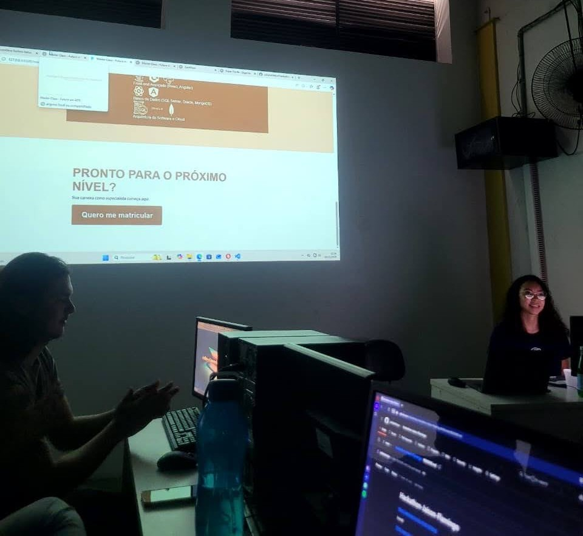

# Mini Hackathon – Faculdade Flamingo

## 📅 Data
06 de dezembro

🌐 Site: https://hackathon-jaison-flamingo.vercel.app

## 📌 Sobre a atividade
Participei de uma dinâmica em formato de **mini hackathon** promovida pela **Faculdade Flamingo**, onde tive o desafio de, em poucas horas, **analisar e melhorar a estrutura de um código pré-definido** pelo professor.

A proposta foi trabalhar de forma individual, aplicando boas práticas de desenvolvimento para tornar o projeto mais organizado, funcional e visualmente aprimorado.

## 🎯 Objetivo
- Refatorar e organizar o código existente  
- Melhorar a estrutura e a legibilidade  
- Aprimorar o design e a estilização da interface  
- Aplicar boas práticas de desenvolvimento front-end  

## 🛠️ Tecnologias e conceitos aplicados
- HTML
- CSS
- Conceitos de design e usabilidade

## 💡 Aprendizados
Essa experiência foi intensa e empolgante, permitindo colocar em prática conhecimentos técnicos em um ambiente com tempo limitado, simulando desafios reais do mercado de tecnologia.  
Além disso, reforçou habilidades como:
- Pensamento rápido e resolução de problemas
- Atenção a detalhes
- Organização de código
- Autonomia no desenvolvimento

